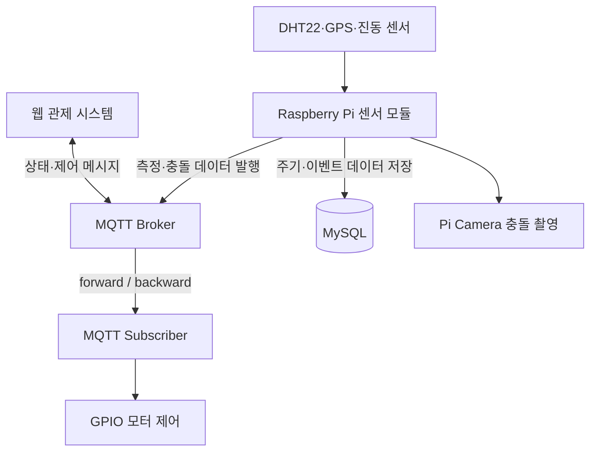

# Smart SunShade Raspberry Pi

> 온습도·위치·진동 데이터를 수집하고 MQTT로 전송하며, 원격 명령에 따라 스마트 그늘막 모터를 제어하는 Raspberry Pi 기반 IoT 장치 서버입니다.


## 프로젝트 개요

Smart SunShade는 지역별로 설치된 스마트 그늘막을 원격으로 관제하기 위한 IoT 시스템입니다. Raspberry Pi가 DHT22, GPS, 진동 센서의 데이터를 수집해 MQTT Broker로 전달하며, 충돌이 감지되면 카메라로 현장 사진을 촬영합니다. 웹 관제 시스템에서 전송한 명령은 MQTT로 수신해 차양막 모터의 정·역회전을 제어합니다.

이 저장소는 전체 시스템 중 **Raspberry Pi 센서 수집·MQTT 통신·모터 제어 영역**을 담당합니다.

| 항목 | 내용 |
| --- | --- |
| 개발 기간 | 2024.03 ~ 2024.08 |
| 개발 인원 | 2명 |
| 담당 영역 | Raspberry Pi 프로토타입, 센서 수집, MQTT 통신, 모터 제어 |
| 주요 장치 | DHT22, GPS 모듈, 진동 센서, Pi Camera, DC 모터 |
| 통신 방식 | MQTT Publish/Subscribe, Serial UART |

## 주요 기능

### 온습도 수집

- GPIO 4에 연결한 DHT22로 섭씨·화씨 온도와 습도 측정
- `sensor/tem_hum` 토픽으로 5초마다 측정 데이터 발행
- 매시 0분과 30분에 측정값을 MySQL에 저장
- 저장 시 측정 시각을 기준으로 오전·오후 구분값 생성

### GPS 위치 수집

- `/dev/ttyS0` 시리얼 포트에서 9,600 bps로 NMEA 데이터 수신
- GGA 문장에서 유효한 위도·경도 추출
- `sensor/gps` 토픽으로 위치 및 측정 시각 발행
- 매월 1일 00시에 장치 위치를 DB에 갱신

### 충돌 감지 및 현장 기록

- GPIO 23의 진동 센서를 100ms 간격으로 확인
- 진동 감지 시 `libcamera-jpeg` 명령으로 640×480 사진 촬영
- 충돌 시각과 Base64 이미지 데이터를 `sensor/crash` 토픽으로 발행
- 원본 이미지와 오류 내용을 MySQL에 저장
- 동일 충돌의 반복 감지를 줄이기 위해 촬영 후 5초 대기

### 원격 모터 제어

- `topic/shadeOn`, `topic/shadeOff` 토픽 구독
- MQTT 메시지의 Payload를 모터 제어 명령으로 전달
- `forward` 수신 시 50% 출력으로 5초간 정방향 회전
- `backward` 수신 시 50% 출력으로 5초간 역방향 회전
- 동작 완료 후 모터 정지 및 GPIO 정리

## 시스템 구성



### 데이터 흐름

1. Raspberry Pi가 각 센서에서 데이터를 읽습니다.
2. 센서별 메시지를 JSON으로 직렬화해 MQTT 토픽에 발행합니다.
3. 주기 데이터 또는 충돌 이벤트는 MySQL에도 별도로 저장합니다.
4. 웹 관제 시스템이 MQTT 제어 토픽에 명령을 발행합니다.
5. Raspberry Pi가 명령 Payload를 해석해 차양막 모터를 구동합니다.

## 기술 스택

| 구분 | 기술 |
| --- | --- |
| Language | Python |
| Device | Raspberry Pi |
| Sensor | DHT22, GPS, 진동 센서 |
| Actuator | DC 모터, PWM 제어 |
| Camera | Raspberry Pi Camera, `libcamera-jpeg` |
| Messaging | Eclipse Paho MQTT |
| Database | MySQL, PyMySQL |
| Hardware API | RPi.GPIO, Adafruit Blinka, Adafruit CircuitPython DHT |
| Serial | PySerial, pynmea2 |

## MQTT 명세

### 발행 토픽

| Topic | 발행 모듈 | 설명 | 발행 시점 |
| --- | --- | --- | --- |
| `sensor/tem_hum` | `tem_hum.py` | 섭씨·화씨 온도, 습도, 측정 일시 | 5초마다 |
| `sensor/gps` | `gps.py` | 위도, 경도, 측정 일시 | 유효한 GGA 수신 시 |
| `sensor/crash` | `ring.py` | 충돌 시각, 상태, Base64 이미지 | 진동 감지 시 |

#### 온습도 메시지

```json
{
  "temp": [24.5, 76.1],
  "hum": 55.2,
  "date": "2024-06-09",
  "time": "14:30:00"
}
```

#### GPS 메시지

```json
{
  "lati": 36.3504,
  "long": 127.3845,
  "date": "2024-06-09",
  "time": "14:30:00"
}
```

#### 충돌 메시지

```json
{
  "time": "2024-06-09 14:30:00",
  "log": "crashed",
  "image": "BASE64_ENCODED_IMAGE"
}
```

### 구독 토픽

| Topic | Payload | 동작 |
| --- | --- | --- |
| `topic/shadeOn` | `forward` | 모터 정방향 구동 |
| `topic/shadeOff` | `backward` | 모터 역방향 구동 |

현재 구현에서는 토픽명이 아닌 **Payload의 `forward` 또는 `backward` 값**으로 모터 방향을 결정합니다.

## GPIO 및 장치 설정

GPIO 번호는 BCM 모드를 기준으로 합니다.

| 장치 | 연결 정보 | 용도 |
| --- | --- | --- |
| DHT22 | GPIO 4 | 온습도 측정 |
| 진동 센서 | GPIO 23 | 충돌 감지 입력 |
| 모터 드라이버 IN1 | GPIO 17 | 정·역회전 방향 제어 |
| 모터 드라이버 IN2 | GPIO 18 | 정·역회전 방향 제어 |
| 모터 드라이버 PWMA | GPIO 27 | 1kHz PWM 출력 |
| GPS | `/dev/ttyS0`, 9600 bps | NMEA 위치 데이터 수신 |
| Pi Camera | `libcamera-jpeg` | 충돌 현장 사진 촬영 |

## 데이터베이스 구성

Raspberry Pi의 현재 IP 주소를 기준으로 장치를 조회하고 데이터를 저장합니다.

| 테이블 | 주요 컬럼 | 용도 |
| --- | --- | --- |
| `device` | `device_num`, `device_ip_address`, `latitude`, `longitude`, `location` | 장치 식별 및 위치 정보 |
| `device_data` | `device_num`, `temp`, `humi`, `current_date`, `day_night`, `current_time`, `location` | 온습도 이력 |
| `error` | `device_num`, `current_time`, `error_content`, `crash`, `current_image` | 충돌 이력 및 현장 이미지 |

| 데이터 | DB 반영 주기 |
| --- | --- |
| 온습도 | 매시 0분, 30분 |
| GPS 위치 | 매월 1일 00시 |
| 충돌 이력 | 감지 즉시 |

## 프로젝트 구조

```text
sensor/
├── __init__.py
├── db.py            # 장치 식별 및 MySQL 저장
├── gps.py           # NMEA GPS 파싱 및 위치 전송
├── motor.py         # GPIO·PWM 기반 모터 제어
├── mqttserver.py    # MQTT 연결, 발행, 구독 처리
├── ring.py          # 진동 감지, 사진 촬영, 충돌 전송
├── tem_hum.py       # DHT22 온습도 수집 및 전송
└── log_image/
    └── test.jpg     # 최근 충돌 촬영 이미지
```

모듈 내부에서 `sensor.*` 경로를 사용하므로 저장소 디렉터리를 `sensor`라는 패키지 이름으로 배치하거나 import 경로를 현재 폴더명에 맞게 변경해야 합니다.

## 실행 환경 구성

### 1. 하드웨어 인터페이스 활성화

Raspberry Pi 설정에서 Camera와 Serial Port를 활성화합니다. GPS 사용 시 Serial Login Shell은 비활성화하고 하드웨어 Serial Port는 활성화해야 합니다.

```bash
sudo raspi-config
```

### 2. Python 가상환경 및 패키지 설치

```bash
python3 -m venv .venv
source .venv/bin/activate
pip install pymysql pillow pyserial pynmea2 paho-mqtt RPi.GPIO \
  adafruit-blinka adafruit-circuitpython-dht
```

환경에 따라 DHT22 사용을 위한 시스템 패키지가 추가로 필요할 수 있습니다.

```bash
sudo apt update
sudo apt install libgpiod2
```

### 3. 연결 정보 설정

다음 파일의 연결 정보를 실행 환경에 맞게 설정합니다.

- `db.py`: MySQL 호스트, 사용자, 비밀번호, DB 이름
- `mqttserver.py`: MQTT Broker 주소와 포트

민감정보는 코드에 직접 작성하지 말고 환경변수 또는 별도의 비공개 설정 파일로 분리하는 것을 권장합니다.

```env
DB_HOST=YOUR_DB_HOST
DB_USER=YOUR_DB_USER
DB_PASSWORD=YOUR_DB_PASSWORD
DB_NAME=YOUR_DB_NAME
MQTT_BROKER=YOUR_MQTT_BROKER
MQTT_PORT=1883
```

> 현재 소스는 환경변수를 직접 읽지 않으므로 공개 저장소에 업로드하기 전에 `os.getenv()` 기반 설정으로 변경해야 합니다.

### 4. 애플리케이션 실행

각 센서 함수는 지속적으로 동작하는 반복 루프입니다. 통합 실행 파일에서 MQTT Client를 한 번 생성한 뒤 다음 작업을 별도 Thread 또는 Process로 실행합니다.

| 함수 | 역할 |
| --- | --- |
| `get_client()` | MQTT 연결 및 제어 토픽 구독 시작 |
| `check_tem_hum(client)` | 온습도 수집·발행 |
| `activate_gps(client)` | GPS 수집·발행 |
| `check_ring(client)` | 진동 감지·촬영·발행 |

이 저장소 스냅샷에는 통합 실행 진입점이 포함되어 있지 않습니다. 위 함수를 호출하는 실행 파일을 프로젝트 환경에 맞게 구성해야 합니다.

## 구현 시 고려사항

- `db.py`와 `mqttserver.py`의 접속정보를 환경변수로 분리해야 합니다.
- MQTT 운영 환경에서는 사용자 인증, TLS, QoS 및 재연결 처리가 필요합니다.
- 충돌 이미지가 MQTT 메시지 크기 제한을 넘지 않도록 해상도·압축률 또는 별도 파일 저장소 사용을 검토해야 합니다.
- GPS 장치가 없는 환경에서는 `gps.py` import 시 시리얼 포트 연결에 실패할 수 있습니다.
- 모터와 진동 센서가 동시에 GPIO를 사용하므로 전체 `GPIO.cleanup()` 대신 사용한 핀만 정리하는 방식이 안전합니다.
- 센서 Thread에서 예외가 발생했을 때 재시작할 수 있도록 프로세스 감시 또는 서비스 등록이 필요합니다.
- 현재 코드의 온습도 MQTT 발행 주기는 5초이며 평균값 집계 로직은 포함되어 있지 않습니다.
